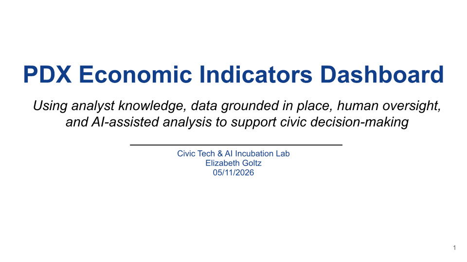
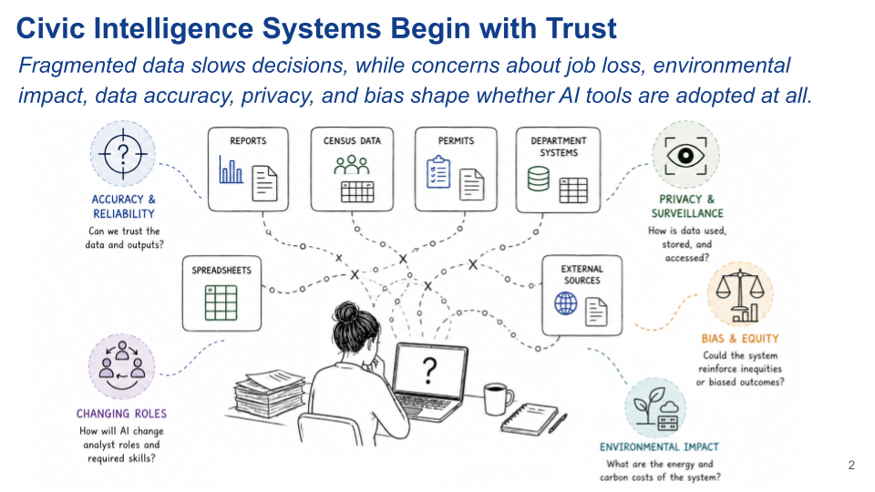
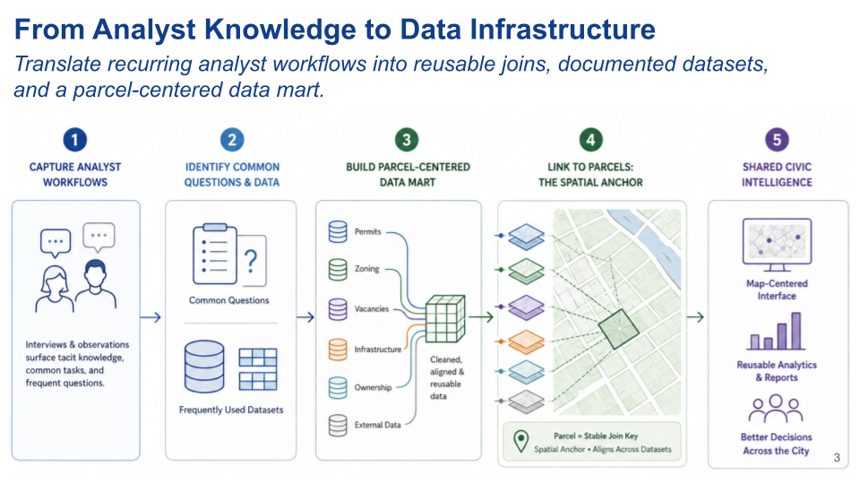
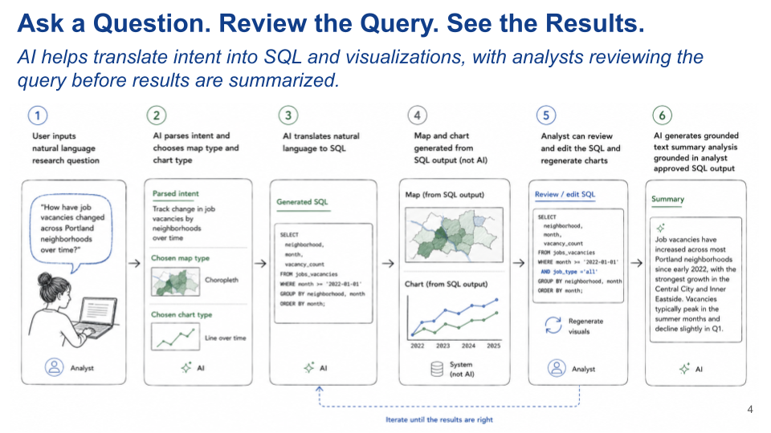
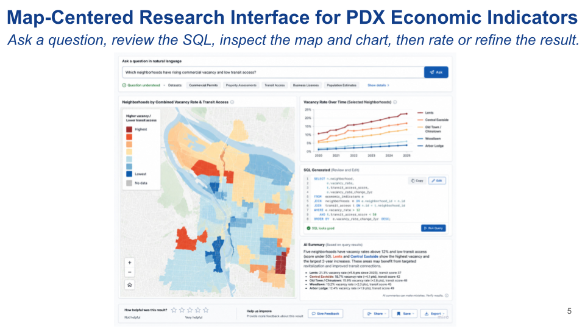
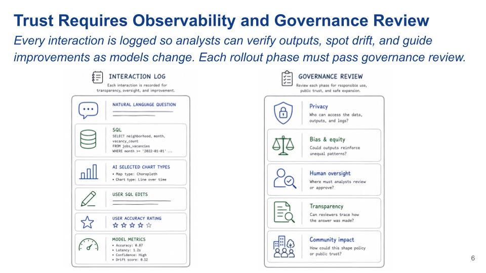
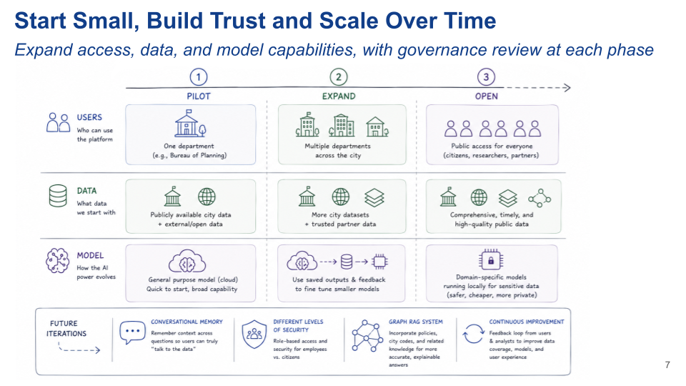

# PDX Economic Indicators Dashboard

## Overview

I presented a pitch for the Economic Indicators Dashboard use case as part of a Civic Tech and AI Innovation Lab, sponsored by the City of Portland and OSU. The lab consisted of an initial presentation, two Q&A sessions with city employees, multile smaller workshop sessions, and a final presentation to city employees and public participants in Portland Startup Week.
I presented a solo pitch for a model-agnostic data and digital transformation plan: a careful, staged approach that uses existing analyst knowledge, place-based data, human review, and AI in bounded, reviewable ways that can scale with trust. My plan was concieved with the idea that in order to explore new technology responsibly and realize some of the big ideas in the room, the city first needs a solid data foundation, employee participation, citizen trust.
## Core Idea
The PDX Economic Indicators Dashboard is designed to help Portland answer civic and economic questions. The system begins with analyst expertise and place-based data infrastructure, then uses AI in limited, reviewable ways to draft SQL, suggest visualizations, and summarize approved results. The goal is a flexible dashboard that works to answer a variety of city questions and supports better decisions while keeping human judgment, transparency, and governance at the center.

## Problem
•	Economic data is fragmented across reports, spreadsheets, permits, census sources, department systems, and external datasets. 
•	Analyst knowledge is often tacit; the people who know how to combine and interpret data hold critical process knowledge in their heads. 
•	AI adoption & trust shaped by concerns about job loss, environmental impact, accuracy, privacy, bias 

## How the system works
1.	Capture recurring analyst questions and workflows. 
2.	Identify common datasets, joins, and spatial relationships. 
3.	Build a place-based data mart using stable geographic anchors, such as parcels, neighborhoods, corridors, districts, or jurisdictions.
4.	Let users ask natural language questions. 
5.	Use AI to draft SQL, suggest maps/charts, and summarize approved query outputs. 
6.	Let analysts review & edit SQL, rate outputs, and improve the system. 

Log Every Interaction for Future Improvement 
•	Original natural language question 
•	Generated SQL 
•	Analyst SQL edits 
•	AI selected map/chart type 
•	AI summary approval or flagging 
•	User helpfulness rating 
•	Analyst accuracy rating 
•	Model version, latency, token efficiency, etc. 
•	Repeated error patterns or drift indicators 

## Phased rollout
1. Pilot
 - One department
 - Publically available or low-risk data
 - General purpose model
2. Expanded 
 - Multiple departments
 - More city and partner data
 - Uses logged outputs to fine tune smaller models
3. Open
 - Access tiers with Public-facing version
 - More comprehensive data
 - Fine-tuned models run locally for sensitive data

## Potential Expansions
Conversational memory, different levels of security for different users, graph RAG system that incorporates city codes and other documents, feedback loop for continuous improvement

## Presentation

 
 

### There are two main problems this project is responding to.
The first is fragmented data, and fragmented knowledge about how to use that data. City data lives across many departments, and the knowledge of how to use it often lives in analysts’ heads. So there is no single source of truth for the data, and no shared source of knowledge for how to use it.
The second problem is trust. This is an AI incubation lab, so we are here to explore civic AI use cases, but there are very valid concerns about AI in government: job loss, environmental impact, surveillance, data privacy, bias, hallucination, and accuracy. And these are valid concerns.
So the design problem I’m addressing is: how do we create a system that helps city employees do their jobs more easily, while also building trust through transparency? If we can show a safe, transparent example of AI-assisted analysis, that can create a more collaborative and creative environment for future civic technology.
 
Before starting with AI, this plan would start with analysts. The people who work with city data every day know which questions come up repeatedly, which datasets to use, which joins are trustworthy, how to tie data to place and the weird edge cases.
So the first step is to capture tacit analyst knowledge through interviews, observation, and workflow mapping. I would want to know: What questions are you asked most often? What reports do you produce repeatedly? What datasets do you manually combine? What do you check before trusting the answer?
From there, we identify common data relationships: repeated joins, common spatial relationships, recurring cleaning steps, and frequently used external dataset. 
Then build out a data mart of commonly used data sets and connect it through geographic anchors. That could be parcel-level data, but it could also be neighborhoods, districts, corridors, or other civic geographies depending on what’s available. This becomes reusable infrastructure.
 
Once that data foundation exists, AI can be used in a much safer and more bounded way.
First, a user starts with a natural language research question.  
Then, AI parses the intent of the question and suggests appropriate output types: a map type, such as a choropleth map, heat map, and a chart type like a bar chart, or line chart over time.
And AI translates the question into a SQL query
The map and chart are generated from the SQL output. The map and chart are not AI-generated images. They are visualizations created from structured query results.
Then the analyst can review or edit the SQL and regenerate the results.
Only after the query and output are grounded does AI generate a brief written summary. Then the user can save or share the visualizations and analysis.
So AI is used for translating the user question into SQL, suggesting visualizations, and summarizing approved results. It is not allowed to invent the data. Each interaction is also logged for improvement, which I’ll get to in a few slides.
 
This mockup shows what the workflow could feel like in practice.
At the top, the user asks a natural language question. In this example, the question is about neighborhoods with rising commercial vacancy and low transit access.
The layout remains the same regardless of the question, with different map or chart types depending. The main output is map-centered because civic and economic questions are about place. The point is to see where patterns are happening.
On the right, the user can see a chart, which varies based on the question, the generated SQL, and a short AI summary.
The analyst can inspect the query, edit it, and rerun the analysis.
The summary is generated after the query results are approved, so the text is grounded in the SQL output rather than generated from the model’s general knowledge. This cuts the risk of hallucination significantly.
The user can rate accuracy and provide feedback. In the early version, this would primarily be an analyst tool, so analysts are the right people to judge whether the SQL, maps, charts, and summaries are actually accurate.
 
If this system is going to be trusted, it needs observability. Every interaction should leave an auditable trail.
On the left, the interaction log could include the original natural language question, the generated SQL, the chart and map type selected, edits to the SQL, user feedback, and model metadata like which model was used, response time, token use, drift. It could also include role or department-level metadata if appropriate, we’d want to be careful about unnecessarily tracking individuals.
These logs allow analysts to verify outputs, identify repeated failure patterns, and spot possible model drift or errors as the system is scaled or upgraded.
On the right side, I’m showing the governance review areas that should be checked before the system expands: privacy, bias and equity, human oversight, transparency, and community impact.
This plan is a model-agnostic because the AI landscape changes quickly. A civic system should not depend entirely on one vendor or one model. And this plan could complement; not replace existing projects the city has to gather analyst tacit knowledge and build out a centralized data lake.
Analysts do not disappear in this model. They become reviewers, validators, and stewards of civic knowledge.

This final slide shows the rollout strategy. The main idea is to start small, build trust, and only scale when the system is ready.
The top part of the slide has three phases: the pilot, expansion, and an open interface where the public could ask questions of city data.
In the pilot phase, I would start with one department, a limited set of publicly available or low-risk data sets, and a general-purpose model. The goal is to test the workflow safely, build trust, create a sandbox for experimentation, low-risk failure, and learning what actually helps analysts do their jobs more efficiently.
In the expand phase, the system could grow to multiple departments, more city datasets, and trusted partner data. At this stage, the interaction logs and analyst feedback become especially important because they show what is working and what needs improvement. New models could also be tested against the transaction log to benchmark their performance. Over time, smaller, more specific models could be tuned for individual AI tasks within the workflow.
In the open phase, some version of the platform could become public-facing, but with careful access controls and governance review. Public users would not necessarily access the same data as internal analysts.
The bottom row shows future iterations, not a separate starting phase. These capabilities would come after the basic system is working and trusted: conversational memory, role-based access, graph RAG system connected to policies and city codes, and continuous improvement based on analyst and user feedback. 