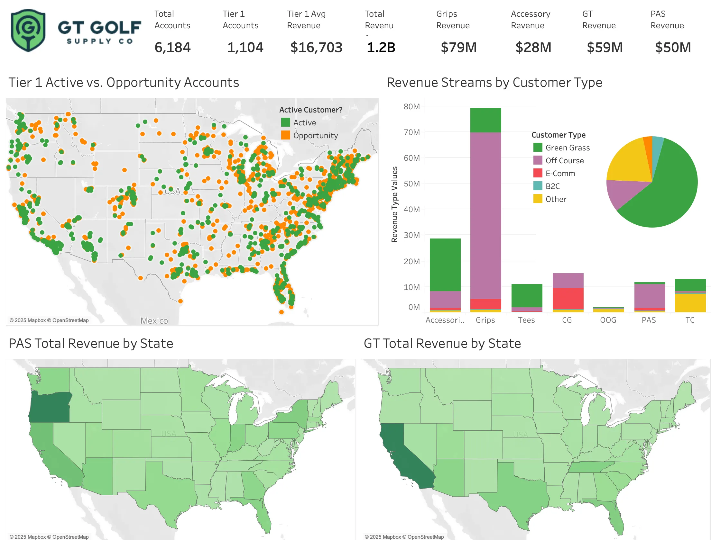

# Marketing Data Cleaning & Customer Segmentation
_Tools & methods: Python, Excel, Tableau, data wrangling, fuzzy matching, k-means clustering, data visualization_



This was a contract project for a PE-backed golf company that had recently aquired several smaller companies with adjacent product lines. Originally scoped as a data hygene project, (to clean, deduplicate and standardize data that had been concatonated from several datasets), he project expanded to segment customer base for marketing strategy and to merge the existing company data to an industry-specific national database, in order to enrich their existing data, find revenue drivers and use that information to find potential new customers.

## Data wrangling

This data was extremely messy and had many non-standardized and blank fields critical for analysis. The data was entered by the company's golf reps, who had their own jargon and varied abbreviations, etc. Newly aquired companies had their own reps and often sold products to the same customers; this was hidden in the data by duplicate customer entries. 

### Fuzzy Matching

I used fuzzy matching in Python because it allows for more control over the process. Because the Golf industry has a lot of similar company names, I wrote my matching algorith to require an exact State match and fuzzy matched the Company Name and Address. I set my Fuzzy match threshold fairly low (75%) and manually reviewed matches between 75-90%.

```python
import pandas as pd
from rapidfuzz import fuzz
from itertools import combinations

MATCH_COLUMNS = ['State']
FUZZY_COLUMNS = ['Company Name', 'Address']
FUZZY_THRESHOLD = 75  

def is_fuzzy_match(row1, row2, threshold=FUZZY_THRESHOLD):
    for col in FUZZY_COLUMNS:
        val1, val2 = str(row1[col]), str(row2[col])
        if fuzz.token_sort_ratio(val1, val2) < threshold:
            return False
    return all(row1[col] == row2[col] for col in MATCH_COLUMNS)

def find_duplicates(df):
    duplicates = []
    checked_pairs = set()

    for i, j in combinations(df.index, 2):
        row1, row2 = df.loc[i], df.loc[j]
        if is_fuzzy_match(row1, row2):
            duplicates.append(row1.to_dict())
            duplicates.append(row2.to_dict())
        checked_pairs.add((i, j))

    return pd.DataFrame(duplicates)

df = pd.DataFrame(gt)
duplicates_df = find_duplicates(df)

# Check results
print(f"Found {len(duplicates_df)} rows from duplicate pairs.")
```
Found 308 rows from duplicate pairs.

## Customer Segmentation
I used k-means on several revenue categories to cluster customers by spending habits.


